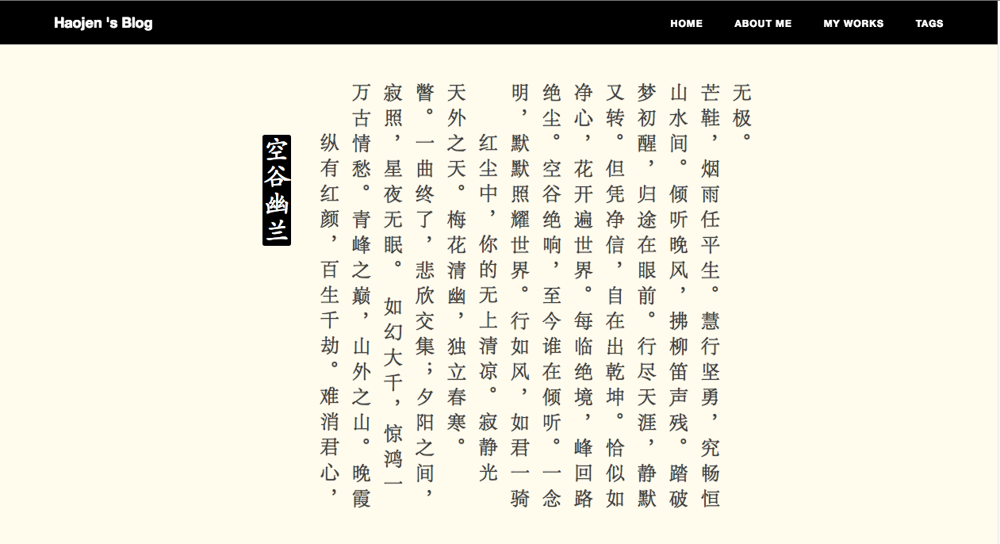

#### Create Tag page

1. use hexo command `hexo new page "Tags"`
2. then open `yourblog/source` folder , find `Tags/index.md`, set `layout: tags`
3. after use hexo command reset hexo `hexo clean && hexo g` , all done : )

#### Create Categories page

1. use hexo command `hexo new page "Categories"`
2. then open `yourblog/source` folder, find `Categories/index.md`, set `layout: categories`
3. after use hexo command reset hexo `hexo clean && hexo g`, all done :)


#### 	cdn-url

Support qiniu images cdn or you custom others, before use this, you need set you own cdn images root path paste of here. 

1. set your cdn-url,in your own ```_config.yml``` , set ```cdn-url``` your own path
	
		cdn-url: http://you-cdn.com/

2. update your images to cdn library

3. in post **front-matter** set your images name

		 header-img: some-images.png
	
in browser,  img src or background-url  will be look like ```http://you-cdn.com/icon-wechat.png``` or ```http://you-cdn.com/header-img```, etc.
	
if you don't need cdn , the default path is hexo ```source/img```folder.

#### clip-*
qiniu imageView2 API

if you wannat to use , you must be configuration cdn-url of qiniu.
about qiniu imageView2 API more info please [click here](http://developer.qiniu.com/code/v6/api/kodo-api/image/imageview2.html)

#### Analytics

Google Analytics and Baidu Tongji simple config:

	#Baidu Analytics**
	ba_track_id: 4cc1f2d8f3067386cc5cdb626a202900

	#Google Analytics
	ga_track_id: 'UA-49627206-1'            # Format: UA-xxxxxx-xx
	ga_domain: huangxuan.me

Just checkout the code offered by Google/Baidu, and copy paste here, all the rest is already done for you.

#### Comment

This theme support both Disqus and Duoshuo as the third party discussion system.

First, you need to sign up and get your own account. Repeat, DO NOT use mine! (I have set Trusted Domains) It is deathly simple to sign up and you will get the full power of management system. Please give it a try!

Second,  you can easily complete your comment configuration by just adding your short name into _config.yml:

	duoshuo_username: _your_duoshuo_short_name_
	# OR
	disqus_username: _your_disqus_short_name_
	
Furthermore, Duoshuo support Sharing. if you only wanna use Duoshuo comment without sharing, you can set duoshuo_share: false. You can use Duoshuo Sharing and Disqus Comments together also.

#### Featured Tags

	featured-tags: true  
	featured-condition-size: 1     # A tag will be featured if the size of 	it is more than this condition value

#### Mini About Me

	# Sidebar settings
	sidebar: true
	sidebar-about-description: "your description here"
	sidebar-avatar: avatar-hux.jpg     

Mini-About-Me module display all your SNS buttons also your avatar and the description if you set sidebar-avatar and sidebar-about-description which is very useful and common for a sidebar so it is default with your sidebar.

It is really nice-looking and well-designed. It would be hidden in a small screen seeing the sidebar would be push to bottom and there is already a footer including SNS feature which is similar.

#### RSS

You can install plugin 'hexo-generator-feed' execute following command:
	npm install hexo-generator-feed --save
if you have already install it, Once you generate static page, atom.xml can auto generation.


then you add your configuration in _config_yml like this:
	plugins: 
		hexo-generator-feed	#RSS订阅插件
	links: #添加链接信息
		Feed: atom.xml

if you want to add label RSS in SNS,you also can append configuration like the belowing behind the 'SNS settings':
	RSS: true

### Post

The **front-matter** of a post looks like that:

	---
	layout: post
	title: "Hola 2016"
	subtitle: "hi, I'm haojen ma"
	date: 2016-05-26 06:00
	author: "Haojen Ma"
	header-img: "img/post-default.jpg"
	cdn: 'header-on'
	tags:
		- Movies
		- Life
	---
	
#### Create a post
	
	hexo new "your-post-name"
	
they will be create a new post in Hexo ```source/_posts``` folder

if your like chinese poetry , you can try  ```poetry``` layout ,they will be cool

	hexo new poetry 'your-poetry-name'
	
 A poetry demo
 


#### Header-img

post header images.
if you don't have set ,this will use post default header images.

	
#### cdn (V2.0 New Feature)

use cdn tag switch single post cdn ,like this:

	cdn: 'header-off' 
	header-img: "http://www.imagestest.com/god.png"
	
this will turn off cdn , and use your custom url
	
when your share post to wechat moments , this post images will show here,
if you don't have set ,this will use post header images(make sure you have set a default image )

## About

- Give is a Star if you like , fork or jest clone to use ,
and also you can help me fix bugs and add new feature :)
- if you have any problem or requirement , just open an issue here and i will help you.
- thanks kaijun and hux.

## License
Apache License Version 2.0
	
